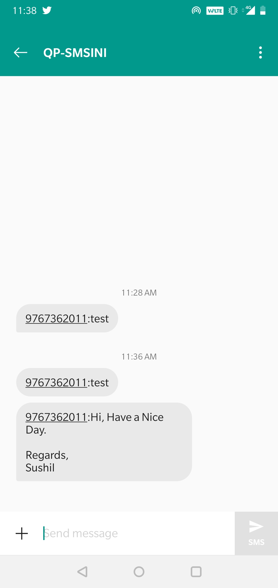
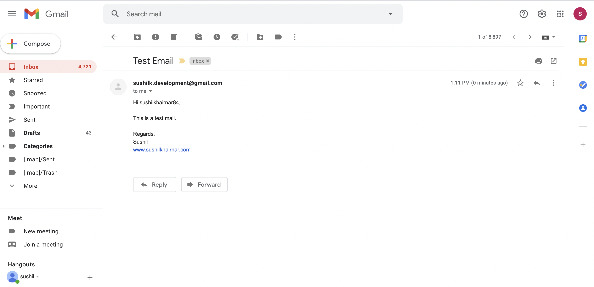
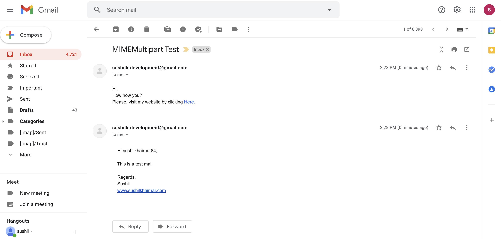
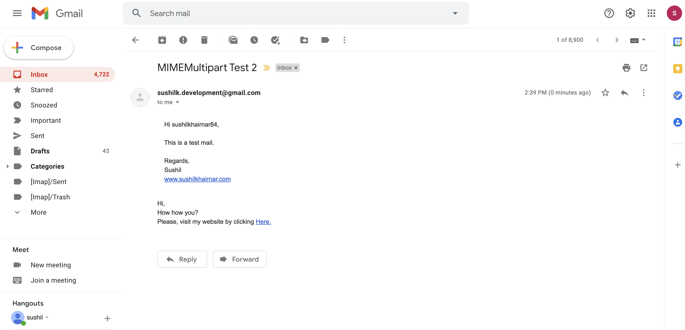
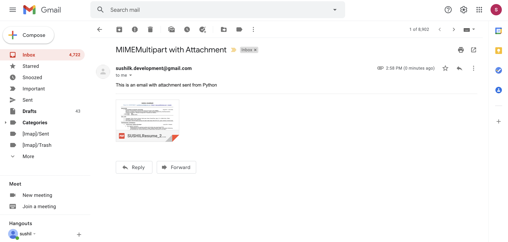

# Email_SMS_Sender

This Projects demonstrates how you can send sms or an email using python script

1. Sending SMS:

2. Sending a Plaintext:

3. Sending a Plaintext/HTML as an alternative:

4. Sending a Plaintext/HTML both together:

5. Adding Attachments to an email:

