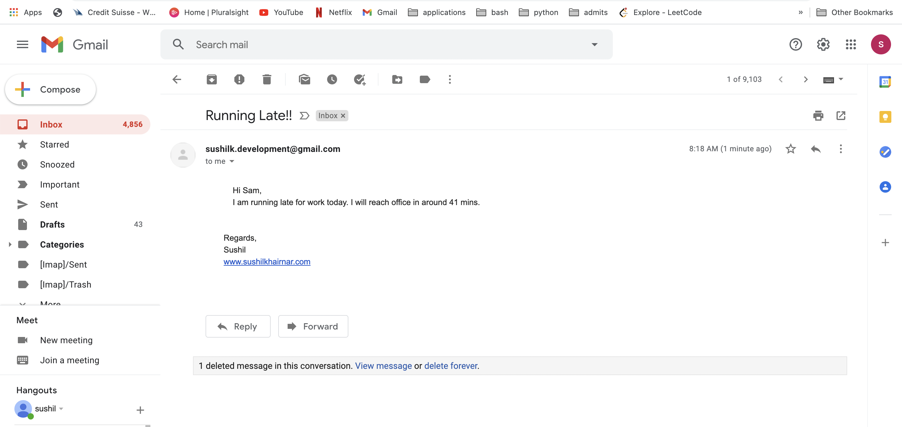
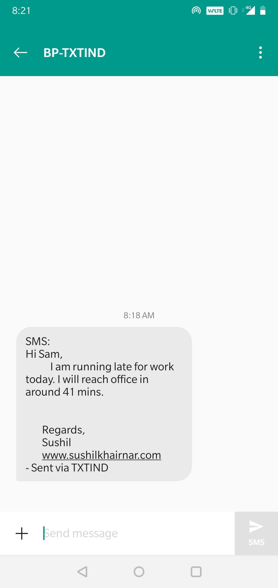

# Notification_Sender

This Projects demonstrates 
1. how you can send SMS using a python script
2. how you can send Email using a python script
3. Google Maps Platform's Distance Metrix API to calculate commute time, and when there's too much traffic, I send an automatic notification about my status to my colleague. The notification is sent through an Email and SMS using a python script.

I. Sending SMS:

SMS could be of type:
1. OTP
2. Transactional 
3. Promotional

There are several SMS Providers few of them include: 
1. Bitrix24 
2. aws.amazon 
3. twilio 
4. msg91 
5. fast2sms

I have used fast2sms api in this project.

II. Sending Emails:

Python comes with the built-in smtplib module for sending emails using the Simple Mail Transfer Protocol (SMTP). smtplib uses the RFC 821 protocol for SMTP.
There are several scenarios when you want to automate your application with python. Few of them are:

1. You want receive email reminders from your code
2. Send a confirmation email to users when they create an account
3. Send emails to members of your organization to remind them to pay their dues.

Steps:

1. Setting up a Gmail Account for Development
2. Install the Google Client Library (pip install --upgrade google-api-python-client google-auth-httplib2 google-auth-oauthlib)
3. Follow steps on https://developers.google.com/calendar/quickstart/python to give a quickstart to your development account.
4. Set up a Local SMTP Server
5. Starting a Secure SMTP Connection

When you send emails through Python, you should make sure that your SMTP connection is encrypted, so that your message and login credentials are not easily accessed by others. SSL (Secure Sockets Layer) and TLS (Transport Layer Security) are two protocols that can be used to encrypt an SMTP connection.

There are two ways to start a secure connection with your email server:

1. Start an unsecured SMTP connection that can then be encrypted using .starttls().
2. Start an SMTP connection that is secured from the beginning using SMTP_SSL().
In both instances, Gmail will encrypt emails using TLS, as this is the more secure successor of SSL.

2 a. Sending Plain text:

2 b. Sending Plain text or HTML as an alternative:

2 c. Sending Plain text and HTML together:

2 d. Adding Attachments to an email:

3. Bot to update my traffic status:

